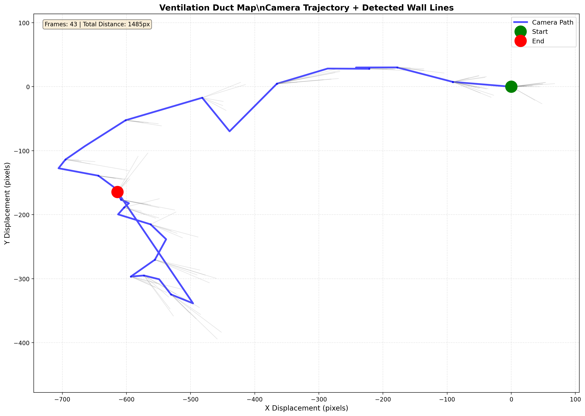

# Ventilation Duct Mapping Prototype 

A proof-of-concept prototype for the **IML** ventilation duct mapping project (part of the **AI Skaalajat** initiative).

This system generates a **2D duct map** from a moving camera video by processing frames, detecting duct walls, tracking camera motion, and plotting the final trajectory.

---

## Demo



---

## What it does

**Input:** a duct inspection video (e.g. `data/test03.mp4`)  
**Output:** extracted frames, detected wall visualizations, motion trajectory data/plots, and a final combined 2D map.

### Pipeline
1. **Frame Extraction** (`src/extract_frames.py`)  
   Samples frames from the input video at a set interval (e.g. 2 FPS) to reduce compute cost.
2. **Line/Wall Detection** (`src/detect_lines.py`)  
   Uses OpenCV (Canny + Hough) to detect structural lines and adapts parameters based on contrast/lighting.
3. **Motion Tracking** (`src/track_motion.py`)  
   Uses Lucas–Kanade optical flow to track feature points and estimate camera displacement over time.
4. **Map Generation** (`src/generate_map.py`)  
   Combines trajectory + detected wall lines into a 2D map with Matplotlib.

---

## Project structure

```text
├── data/                  # Input videos
├── output/                # Generated results (frames, trajectories, maps)
├── src/                   # Source modules
│   ├── detect_lines.py
│   ├── extract_frames.py
│   ├── generate_map.py
│   └── track_motion.py
└── main.py                # Orchestrator
```

---

## Prerequisites
- Python 3.x
- Dependencies:

```bash 
pip install opencv-python numpy matplotlib
```

## Quick start

1.	Put your input video in data/ (example: data/test03.mp4).
2.	If needed, update the path in main.py:

```python
video_path = 'data/test03.mp4'
```

3.	Run the main script:

```bash
python main.py
```

## Output
After completion, results are saved under output/:
- output/frames/ — extracted frames
- output/detected/ — wall/line detection visualizations
- output/trajectory/ — raw .npy data + trajectory plots
- output/maps/final_map.png — final combined 2D map

---

I’m eager to extend this prototype with more advanced AI/Deep Learning methods and support Garage lab development and maintenance.